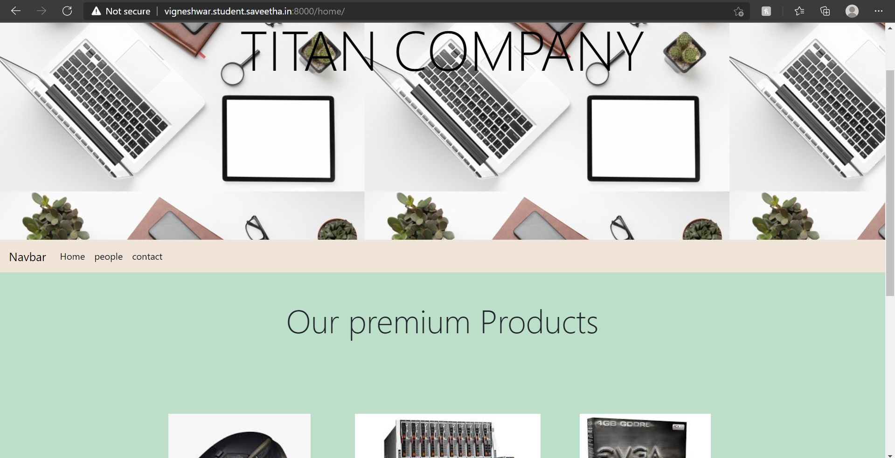
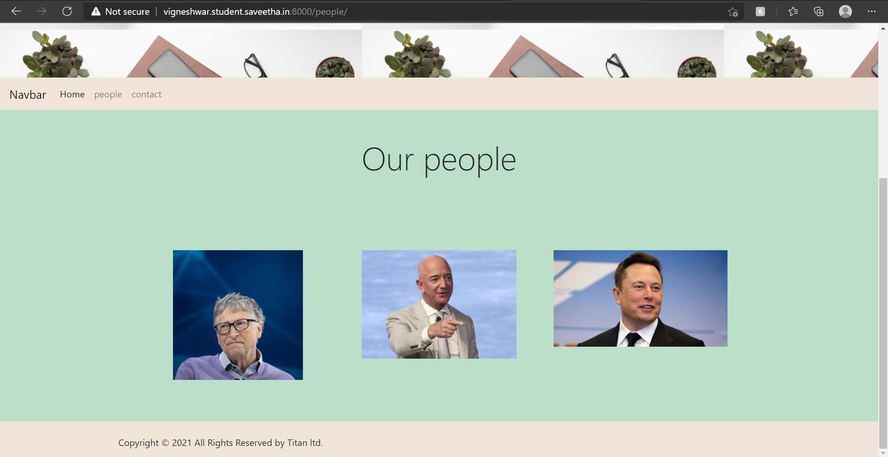
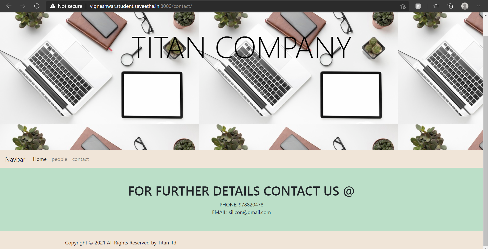
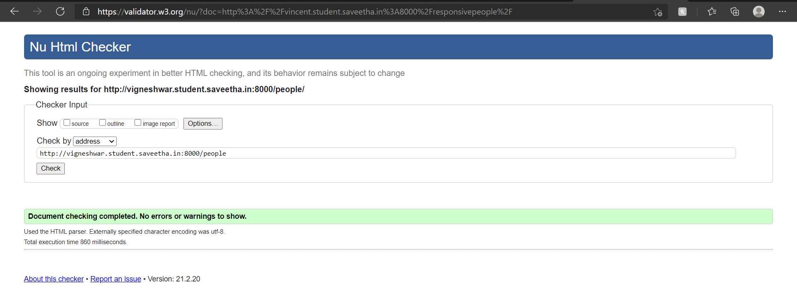
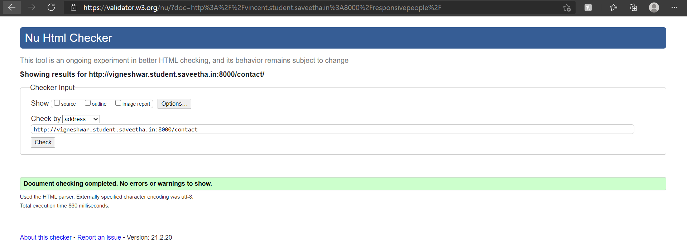
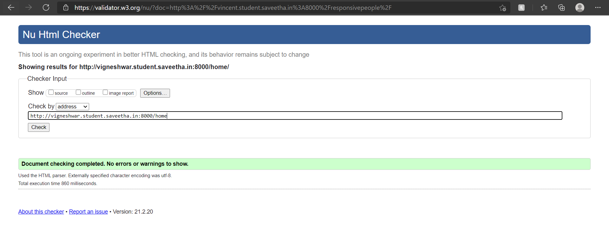

# Design of Responsive Website
## AIM:
To design a responsive website with two break points.

## DESIGN STEPS:
### Step 1: 
Requirement collection.
### Step 2:
Creating the layout using HTML and CSS.
### Step 3:
Updating the sample content.
### Step 4:
Choose the appropriate style and color scheme.
### Step 5:
Validate the layout in various browsers.
### Step 6:
Validate the HTML code.
### Step 7:
Create a database model and migrate the database.
### Step 8:
Retrieve data from database and display it in a dynamic webpage.
### Step 9:
Publish the website in the given URL.

## PROGRAM:

### responsive.html:
```

<!DOCTYPE html>
<html lang="en">
<head>
    <meta charset="UTF-8">
    <meta name="viewport" content="width=device-width, initial-scale=1.0">
    <title>Document</title>
    <link rel="stylesheet" href="https://cdn.jsdelivr.net/npm/bootstrap@4.6.0/dist/css/bootstrap.min.css" integrity="sha384-B0vP5xmATw1+K9KRQjQERJvTumQW0nPEzvF6L/Z6nronJ3oUOFUFpCjEUQouq2+l" crossorigin="anonymous">
    <link rel="stylesheet" href="">
</head>
<body>
    <div class="container-fluid text-center bg p-5">
        <h1 class="display-1" style="padding-top: 65px; color: black;">TITAN COMPANY</h1>
    </div>
    <div class="bg1">
        <nav class="navbar navbar-expand-lg  bg2">
            <a class="navbar-brand" href="#" style="color: black;">Navbar</a>
            
            <div id="navbarNavAltMarkup">
              <div class="navbar-nav">
                <a class="nav-link active" style="color: black;" href="#" >Home <span class="sr-only">(current)</span></a>
                <a class="nav-link" style="color: black;" href="/people">people</a>
                <a class="nav-link" style="color: black;" href="/contact">contact</a>
              </div>
            </div>
          </nav>
        <div class="container p-5">
            <div class="row">
                <div class="col-lg-12 text-center">
                    <h3 class="display-4">Our premium Products</h3>
                </div>
            </div>
        </div>
        <div class="container">
            <div class="row p-5">
                <div class="col-sm-4 p-4 text-center">
                    
                </div>
                <div class="col-sm-4 p-4 text-center">
                    
                </div>
                <div class="col-sm-4 p-4 text-center">
                    
                </div>
                <div class="col-sm-4 p-4 text-center">
                    
                </div>
                <div class="col-sm-4 p-4 text-center">
                    
                </div>
                <div class="col-sm-4 p-4 text-center">
                    
                </div>
            </div>
        </div>
    </div>
      <!-- Site footer -->
      <footer class="site-footer bg3">
        <div class="container">
          <div class="row">
            <div class="col-md-8 col-sm-6 col-xs-12">
                <br>
              <p class="copyright-text">Copyright &copy; 2021 All Rights Reserved by Titan ltd.
              </p>
            </div>
          </div>
        </div>
  </footer>
</body>
<script src="https://code.jquery.com/jquery-3.5.1.slim.min.js" integrity="sha384-DfXdz2htPH0lsSSs5nCTpuj/zy4C+OGpamoFVy38MVBnE+IbbVYUew+OrCXaRkfj" crossorigin="anonymous"></script>
<script src="https://cdn.jsdelivr.net/npm/bootstrap@4.6.0/dist/js/bootstrap.bundle.min.js" integrity="sha384-Piv4xVNRyMGpqkS2by6br4gNJ7DXjqk09RmUpJ8jgGtD7zP9yug3goQfGII0yAns" crossorigin="anonymous"></script>
</html>
```

### people.html:
```

<!DOCTYPE html>
<html lang="en">
<head>
    <meta charset="UTF-8">
    <meta name="viewport" content="width=device-width, initial-scale=1.0">
    <title>Document</title>
    <link rel="stylesheet" href="">
    <link rel="stylesheet" href="https://cdn.jsdelivr.net/npm/bootstrap@4.6.0/dist/css/bootstrap.min.css" integrity="sha384-B0vP5xmATw1+K9KRQjQERJvTumQW0nPEzvF6L/Z6nronJ3oUOFUFpCjEUQouq2+l" crossorigin="anonymous">
</head>
<body>
    <div class="container-fluid text-center bg p-5">
        <h1 class="display-1" style="padding-top: 65px; color: black;">TITAN COMPANY</h1>
    </div>
    <div class="bg1">
        <nav class="navbar navbar-expand-lg navbar-light bg2">
            <a class="navbar-brand" href="#">Navbar</a>
            <button class="navbar-toggler" type="button" data-toggle="collapse" data-target="#navbarNavAltMarkup" aria-controls="navbarNavAltMarkup" aria-expanded="false" aria-label="Toggle navigation">
              <span class="navbar-toggler-icon"></span>
            </button>
            <div class="collapse navbar-collapse" id="navbarNavAltMarkup">
              <div class="navbar-nav">
                <a class="nav-link active" href="/home">Home </a>
                <a class="nav-link" href="/people">people</a>
                <a class="nav-link" href="/contact">contact</a>
              </div>              
            </div>
        </nav>
        <div class="container p-5">
            <div class="row">
                <div class="col-lg-12 text-center">
                    <h3 class="display-4">Our people</h3>
                </div>
            </div>
        </div>
        <div class="container">
            <div class="row p-5">
                <div class="col-sm-4 p-4 text-center">
                    
                </div>
                <div class="col-sm-4 p-4 text-center">
                    
                </div>
                <div class="col-sm-4 p-4 text-center">
                    
                </div>
            </div>
        </div>
    </div>
      <!-- Site footer -->
      <footer class="site-footer bg3">
        <div class="container">
          <div class="row">
            <div class="col-md-8 col-sm-6 col-xs-12">
                <br>
              <p class="copyright-text">Copyright &copy; 2021 All Rights Reserved by Titan ltd.
              </p>
            </div>
          </div>
        </div>
  </footer>
</body>
<script src="https://code.jquery.com/jquery-3.5.1.slim.min.js" integrity="sha384-DfXdz2htPH0lsSSs5nCTpuj/zy4C+OGpamoFVy38MVBnE+IbbVYUew+OrCXaRkfj" crossorigin="anonymous"></script>
<script src="https://cdn.jsdelivr.net/npm/bootstrap@4.6.0/dist/js/bootstrap.bundle.min.js" integrity="sha384-Piv4xVNRyMGpqkS2by6br4gNJ7DXjqk09RmUpJ8jgGtD7zP9yug3goQfGII0yAns" crossorigin="anonymous"></script>
</html>
```

### contact.html:
```

<!DOCTYPE html>
<html lang="en">
<head>
    <meta charset="UTF-8">
    <meta name="viewport" content="width=device-width, initial-scale=1.0">
    <title>Document</title>
    <link rel="stylesheet" href="">
    <link rel="stylesheet" href="https://cdn.jsdelivr.net/npm/bootstrap@4.6.0/dist/css/bootstrap.min.css" integrity="sha384-B0vP5xmATw1+K9KRQjQERJvTumQW0nPEzvF6L/Z6nronJ3oUOFUFpCjEUQouq2+l" crossorigin="anonymous">
</head>
<body>
    <div class="container-fluid text-center bg p-5">
        <h1 class="display-1" style="padding-top: 65px; color: black;">TITAN COMPANY</h1>
    </div>
    <div class="bg1">
        <nav class="navbar navbar-expand-lg navbar-light bg2">
            <a class="navbar-brand" href="#">Navbar</a>
            <button class="navbar-toggler" type="button" data-toggle="collapse" data-target="#navbarNavAltMarkup" aria-controls="navbarNavAltMarkup" aria-expanded="false" aria-label="Toggle navigation">
              <span class="navbar-toggler-icon"></span>
            </button>
            <div class="collapse navbar-collapse" id="navbarNavAltMarkup">
              <div class="navbar-nav">
                <a class="nav-link active" href="/home">Home </a>
                <a class="nav-link" href="/people">people</a>
                <a class="nav-link" href="/contact">contact</a>
              </div>              
            </div>
        </nav>
        <div class="container p-5">
            <div class="row">
                <div class="col-lg-12 text-center">
                    <h1>FOR FURTHER DETAILS CONTACT US @</h1>
                    <div class="itemname">PHONE: 978820478</div>
                    <div class="itemname">EMAIL: silicon@gmail.com</div>
                </div>
            </div>
        </div>
    </div>
      <!-- Site footer -->
      <footer class="site-footer bg3">
        <div class="container">
          <div class="row">
            <div class="col-md-8 col-sm-6 col-xs-12">
                <br>
              <p class="copyright-text">Copyright &copy; 2021 All Rights Reserved by Titan ltd.
              </p>
            </div>
          </div>
        </div>
  </footer>
</body>
<script src="https://code.jquery.com/jquery-3.5.1.slim.min.js" integrity="sha384-DfXdz2htPH0lsSSs5nCTpuj/zy4C+OGpamoFVy38MVBnE+IbbVYUew+OrCXaRkfj" crossorigin="anonymous"></script>
<script src="https://cdn.jsdelivr.net/npm/bootstrap@4.6.0/dist/js/bootstrap.bundle.min.js" integrity="sha384-Piv4xVNRyMGpqkS2by6br4gNJ7DXjqk09RmUpJ8jgGtD7zP9yug3goQfGII0yAns" crossorigin="anonymous"></script>
</html>
```
## OUTPUT:






### code validation:






## RESULT:
Thus a website is designed and is hosted in the URL http://vigneshwar.student.saveetha.in:8000/. HTML code is validated.